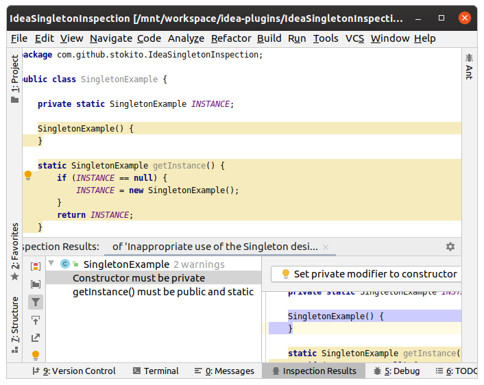

# Singleton pattern inspection plugin for IntelliJ Idea

[Singleton Inspection Plugin at plugins portal](https://plugins.jetbrains.com/plugin/6015-singleton-inspection)

This inspection reports about (probably) inappropriate use of [Singleton pattern](https://en.wikipedia.org/wiki/Singleton_pattern).
Just write `getInstance()` method, and this inspection will check this class like a Singleton.
Singleton class should be checked for next errors:
* Class should be final.
* Class should have private constructor.
* `getInstance()` method must be public and static and return instance of its class.

You may be also interested in [JPatterns](http://www.jpatterns.org/) library for patterns annotations.
